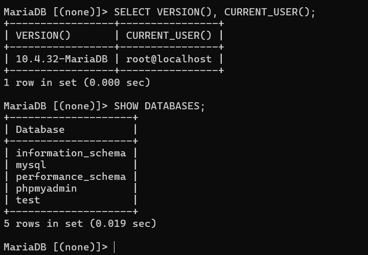
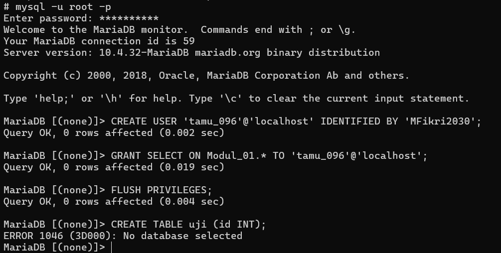
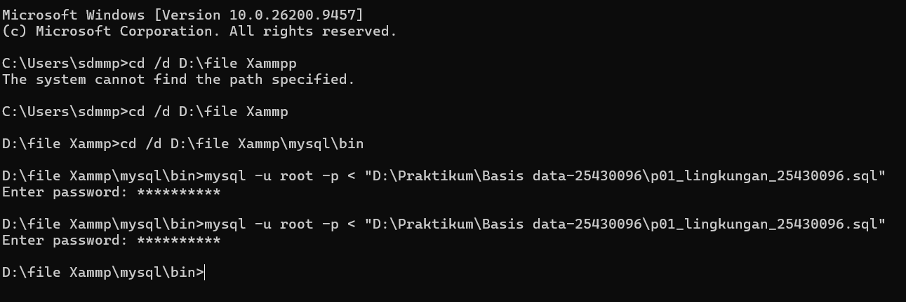
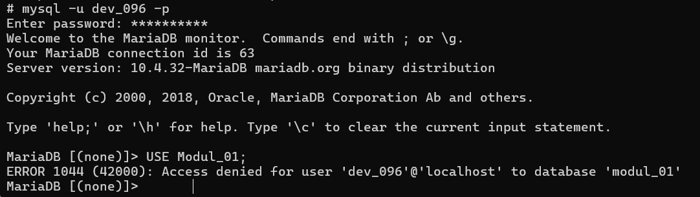
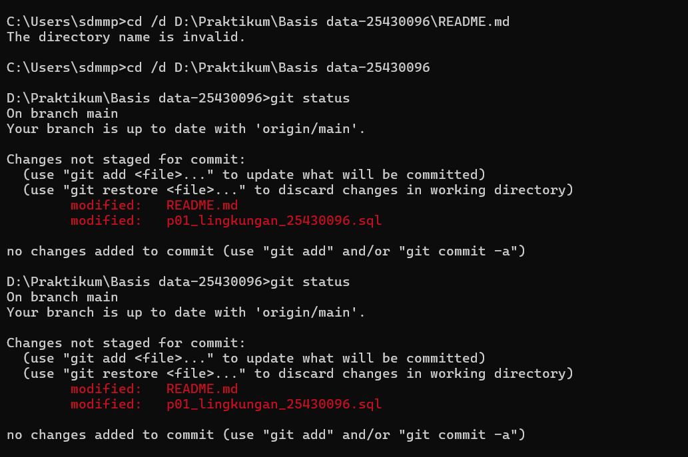

# Laporan Praktikum Basis Data - Pertemuan 01

**Nama:** Muhammad Fikri Misbahudin  
**NIM:** 25430096  
**Kelas:** D  
**Tanggal:** 4 Oktober 2026  

---

## 1. Tujuan Praktikum

- Mengonfigurasi lingkungan kerja praktikum basis data mencakup MySQL/MariaDB, VS Code, dan Git.
- Memahami administrasi pengguna basis data, pembatasan hak akses (*privileges*), serta pembuatan basis data.
- Mengimplementasikan konsep skrip SQL yang *idempotent* menggunakan klausa `IF NOT EXISTS`.
- Mengintegrasikan proyek praktikum ke repositori GitHub serta menyusun laporan berformat Markdown.

---

## 2. Ringkasan Dasar Teori

DBMS (seperti MariaDB) menyediakan fitur administrasi pengguna untuk menjaga keamanan data. Pengguna dapat dibuat menggunakan perintah `CREATE USER` dan diberikan hak akses spesifik (seperti `SELECT`, `CREATE`, atau `ALL PRIVILEGES`) menggunakan `GRANT`. Prinsip *least privilege* diterapkan agar setiap pengguna hanya memiliki akses sesuai kebutuhan tugasnya. Selain itu, eksekusi skrip SQL secara aman membutuhkan sifat *idempotency*, yaitu kemampuan skrip untuk dijalankan berulang kali tanpa menghasilkan galat jika objek basis data sudah ada sebelumnya.

---

## 3. Hasil Langkah Percobaan

- **Inisialisasi Database Akademik:**  
  
  
  *Gambar 3.1: Pembuatan database akademik_096 dan pengecekan daftar database.*

---

## 4. Jawaban Titik Analisis

- **Titik Analisis 1 (Akses Pengguna Tamu):**  
  *Mengapa pengguna `tamu_096` tidak bisa membuat tabel baru?*  
  **Jawaban:** Pengguna `tamu_096` hanya diberikan hak akses `SELECT` pada basis data. Ketika menjalankan query `CREATE TABLE`, sistem memblokirnya karena perintah `CREATE` membutuhkan hak akses khusus yang tidak dimiliki oleh akun tamu tersebut.

- **Titik Analisis 2 (Penggunaan `IF NOT EXISTS`):**  
  *Apa fungsi klausa `IF NOT EXISTS` pada skrip pembuatan database dan user?*  
  **Jawaban:** Klausa tersebut mencegah terjadinya galat saat skrip dijalankan ulang. Jika objek (database/user) sudah ada di dalam server, DBMS hanya akan menampilkan peringatan (*warning*) dan melanjutkan eksekusi skrip tanpa menghentikan proses (*error*).

---

## 5. Hasil Latihan dan Modifikasi

- **Latihan 1: Pengujian Akun Tamu**
  

  *Gambar 5.1: Pengujian pembuatan akun tamu_096 dan galat saat membuat tabel.*

- **Latihan 2: Skrip Idempotent (`p01_lingkungan_25430096.sql`)**
   

  *Gambar 5.2: Eksekusi skrip SQL lingkungan secara berulang.*

---

## 6. Tugas Mandiri: Milestone Proyek 01

- **Pengujian Pembatasan Akses:**  
   

  *Gambar 6.1: Pesan galat ERROR 1044 (42000) terbukti dev_096 tidak bisa mengakses database modul_01.*

---

## 7. Pembahasan dan Kendala

- **Kendala 1 (`'mysql' is not recognized`):**  
  Pesan galat muncul karena path lokasi XAMPP (`C:\xampp\mysql\bin`) belum terdaftar di *Environment Variables* sistem Windows.  
  *Cara Mengatasi:* Berpindah direktori terlebih dahulu ke `C:\xampp\mysql\bin` atau menambahkan path `mysql/bin` ke Sistem Environment Variables Windows.
- **Kendala 2 (`ERROR 1046: No database selected`):**  
  Galat terjadi saat mencoba membuat tabel tanpa memilih basis data target terlebih dahulu.  
  *Cara Mengatasi:* Menjalankan perintah `USE Modul_01;` terlebih dahulu sebelum mengeksekusi instruksi SQL DDL.
- **Kendala 3 (`error: src refspec main does not match any`):**  
  Terjadi saat push ke GitHub karena cabang lokal default masih bernama `master` sedangkan target push mengarah ke `main`.  
  *Cara Mengatasi:* Mengubah nama cabang lokal menggunakan perintah `git branch -M main` sebelum melakukan push.

---

## 8. Kesimpulan

Praktikum ini berhasil mengonfigurasi lingkungan kerja basis data dan integrasi versi Git/GitHub. Pengaturan hak akses pengguna terbukti efektif mengisolasi hak akses data sesuai peran (`dev_096` dan `tamu_096`), serta penerapan klausa `IF NOT EXISTS` berhasil menjadikan skrip SQL bersifat *idempotent* untuk kebutuhan otomasi.

---

## 9. Pernyataan Penggunaan AI

Praktikum ini menggunakan asisten AI (Gemini) untuk membantu analisis pesan galat di terminal, penyusunan skrip SQL *idempotent*, serta pengecekan struktur format Markdown laporan sesuai aturan buku panduan.

---

## 10. Bukti Git

*Gambar 10.1: Bukti eksekusi git add, git commit, dan git push ke repositori GitHub.*

- **Tautan Repositori:** https://github.com/officialdimas456-collab/basisdata-25430096.git  
- **Hash Commit:** `f578dfc` (Pesan: `p01_laporan_praktikum_basis_data_25430096.md`)

---

## 11. Checklist

| Butir | Yang Harus Ada | Status |
| :--- | :--- | :---: |
| Identitas | Nama, NIM, kelas, pertemuan ke-1, tanggal pelaksanaan | ✔ |
| Tujuan | Tujuan praktikum ditulis ulang dengan bahasa sendiri | ✔ |
| Ringkasan Teori | Pemahaman sendiri atas Dasar Teori | ✔ |
| Langkah | Tangkapan layar hasil langkah kunci + keterangan | ✔ |
| Titik Analisis | Semua Titik Analisis dijawab lengkap dengan alasan | ✔ |
| Latihan | Skrip/dokumen hasil latihan beserta bukti berjalan | ✔ |
| Tugas Mandiri | Milestone proyek pertemuan ini: berkas, bukti, dan penjelasan | ✔ |
| Pembahasan & Kendala | Galat yang ditemui, cara membaca, dan cara mengatasinya | ✔ |
| Kesimpulan | Dua sampai empat kalimat dengan bahasa sendiri | ✔ |
| Pernyataan Penggunaan AI | Alat yang dipakai, untuk apa, bagian mana | ✔ |
| Bukti Git | Tautan repositori dan kode commit (hash) | ✔ |
| Keaslian | Tangkapan layar menampilkan akun ber-NIM dan jam sistem | ✔ |

## 12. Checklist Khusus Laporan Pertemuan 1

| Check | Jenis | Yang Harus Ada | Status |
| :---: | :--- | :--- | :---: |
|**Berkas wajib** | `p01_lingkungan_25430096.sql` (dapat dijalankan ulang), `README.md` berisi Identitas Proyek, `.gitignore` | ✔ |Terpenuhi |
|**Bukti tangkapan layar** | `SELECT VERSION(), CURRENT_USER();`, `SELECT @@sql_mode;`, `SHOW DATABASES` sebagai `mhs_096` dan `dev_096`; galat 1044 dan 1142; halaman masuk phpMyAdmin mode `cookie`; `git push` pertama | ✔ | Terpenuhi |
|**Analisis wajib** | Titik Analisis 1–4; perbedaan kode galat 1044, 1045, dan 1142 | ✔ | Terpenuhi |

---